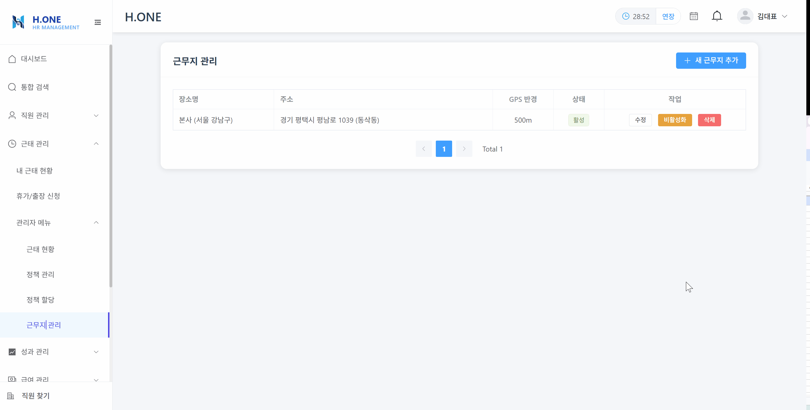
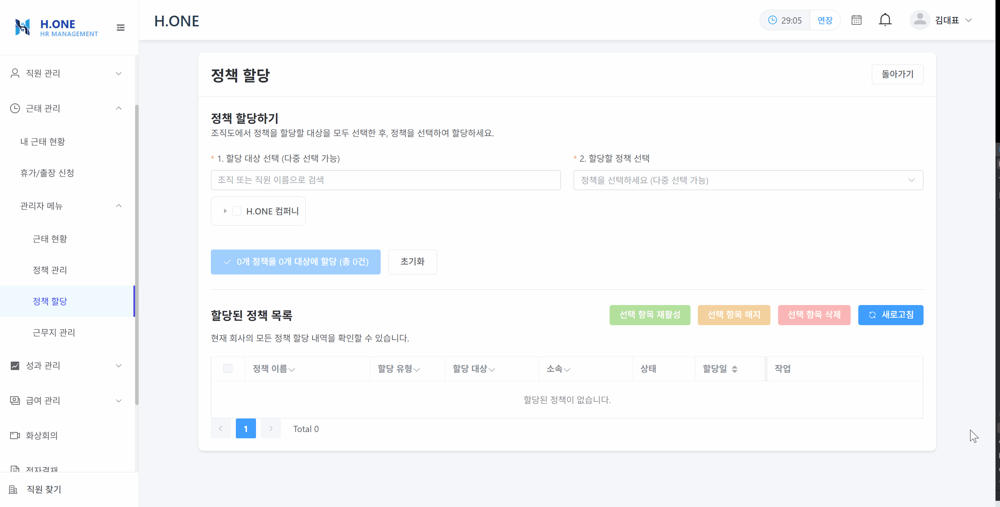
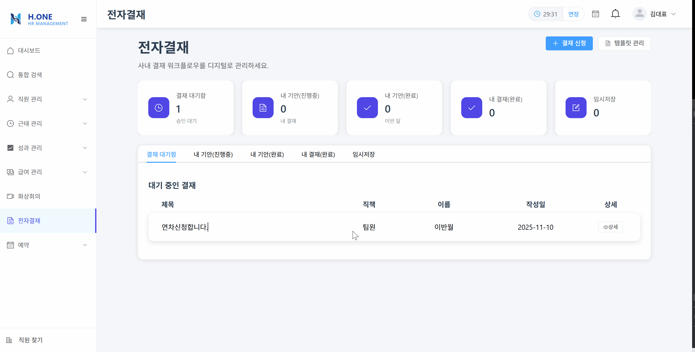
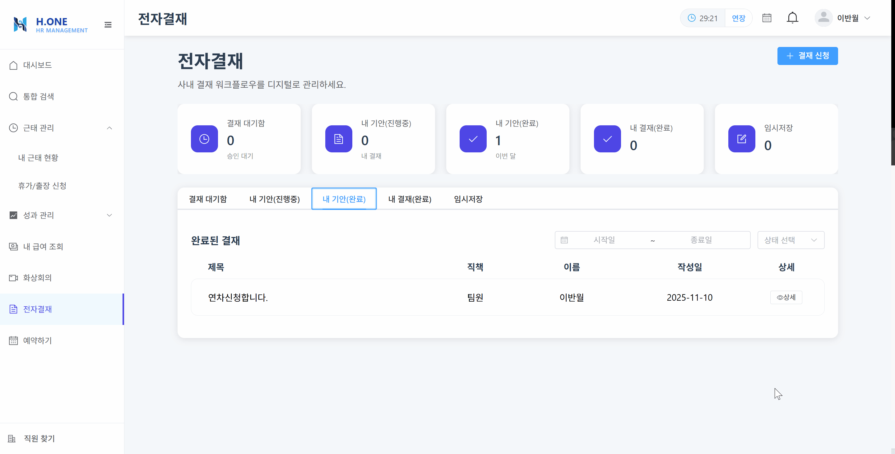

# [H.ONE]


## 팀원 소개

| **김송옥** | **정지완** | **김지현** | **최승휘** | **위동길** |
| :---: | :---: | :---: | :---: | :---: |
| [ <br/> @songok14](https://github.com/songok14) | [ <br/> @FOJF](https://github.com/FOJF) | [ <br/> @Jihyeon0804](https://github.com/Jihyeon0804) | [ <br/> @kishinoa](https://github.com/kishinoa) | [ <br/> @mozzibeam](https://github.com/mozzibeam) |

---

# 목차
| **문서명** | **분류** | **설명** |
|--------|----------|----------|
| [프로젝트 추진 배경](#1-프로젝트-추진-배경) | 기획 | 프로젝트 배경 |
| [프로젝트 목적](#2-프로젝트-목적) | 기획 | 프로젝트 목적 |
| [추진 전략 (핵심 목표)](#3-추진-전략-핵심-목표) | 기획 | 프로젝트 목적 |
| [요구사항 정의서](https://docs.google.com/spreadsheets/d/1OWBwOKICwviN1j20aa2d0-GFYH7mc54pXyNh_uE32rs/edit?gid=0#gid=0) | 기획 | 기능 및 비기능 요구사항 정의 |
| [WBS](https://docs.google.com/spreadsheets/d/1OWBwOKICwviN1j20aa2d0-GFYH7mc54pXyNh_uE32rs/edit?gid=437381057#gid=437381057) | 기획 | 업무 분장 및 세부 일정 |
| [ERD](https://www.erdcloud.com/d/putcJAPJZgGAzeqBS) | 기획 | 데이터베이스 구조 및 관계 |
| [화면설계서](https://www.figma.com/design/xpNgDkijDVTtfj1qtteclD/Team-project?node-id=939-12738&t=uA5ilLzLXs6EpFeA-1) | 기획 | UI/UX 화면 흐름 및 구조 |
| [단위 테스트 결과서](https://documenter.getpostman.com/view/48728965/2sB3QQH7M2) | 백엔드 | 기능별 테스트 결과 |
| [주요 기술 아키텍처](#4-주요-기술-아키텍처) | 기술 | 프로젝트 |
| [기술 스택](#5-기술-스택) | 기술 | 프로젝트 사용 기술 명세 |
| [시스템 아키텍처(CI/CD 계획서)](#6-시스템-아키텍처cicd-계획서) | 시스템 통합 | 배포 및 자동화 계획 |
| [UI/UX 단위테스트](#7-uiux-단위테스트) | 프론트엔드 | 사용자 테스트 결과 |
| [회고록](#8-회고록) | 회고 | 개인 회고록 |


## 1. 프로젝트 추진 배경

> 기존 기업용 솔루션 시장에는 다음과 같은 몇 가지 문제점이 존재합니다.

* **HR과 협업 도구의 분리:** 인사 정보(조직도, 휴가)는 HR 시스템에, 실제 업무(채팅, 결재, 화상회의)는 별개의 협업 툴(그룹웨어)에서 이루어집니다. 이는 데이터의 이중 관리, 불필요한 비용 발생, 단절된 사용자 경험을 유발합니다.
* **파편화된 HR 기능:** 급여, 평가, 근태 등 핵심 HR 기능들마저 각각 별개의 시스템으로 분리되어 운영되는 경우가 많아, 데이터 연동과 통합 관리에 어려움이 있습니다.
* **경직된 UI/UX:** 대부분의 기존 솔루션은 기능 중심의 복잡하고 딱딱한 UI/UX를 제공하여, 사용자가 배우기 어렵고 일상적인 사용에 피로감을 줍니다.
* **높은 도입 장벽:** 많은 솔루션이 기업 서버에 직접 설치하는 구축형(On-premise)으로 제공되어, 초기 비용과 유지보수 부담으로 인해 중소기업(SME)의 접근성이 떨어집니다.
* **수기 관리에 따른 비효율:** 여전히 휴가 신청, 근태 기록 등을 수기나 엑셀로 관리하는 경우가 많아, 불필요한 행정 소요와 데이터 오류 가능성이 상존합니다.

---

## 2. 프로젝트 목적

> H.ONE은 문제점들을 해결하고, 모든 규모의 기업이 하나의 플랫폼에서 인사와 협업을 동시에 해결할 수 있는 **클라우드 기반 통합 HR-협업 플랫폼**을 제공하는 것을 목적으로 합니다.

* **HR과 협업의 유기적 결합:** 조직도, 근태/휴가 정보가 채팅, 결재, 화상회의 등 협업 기능과 실시간으로 연동되어, 별도 시스템을 오갈 필요 없는 원스톱(One-stop) 업무 환경을 제공합니다.
* **직관적이고 매력적인 UI/UX:** 사무적이고 딱딱한 디자인에서 벗어나, 현대적이고 직관적인 사용자 경험(UI/UX)을 제공합니다.
* **클라우드(SaaS) 기반 서비스:** 별도 설치가 필요 없는 구독형 클라우드 서비스(SaaS)로 제공하여, 소규모 기업도 비용 부담 없이 즉시 도입하고 운영할 수 있도록 합니다.
* **업무 효율성 극대화:** 모든 HR 및 협업 프로세스를 전산화하고 자동화하여, 수기 작성과 시스템 간 이동으로 인한 불필요한 행정 소요를 획기적으로 개선합니다.

---

## 3. 추진 전략 (핵심 목표)

> 프로젝트 목적을 달성하기 위해 다음과 같은 핵심 기능들을 단계적으로 개발합니다.

### 핵심 HR 관리

* **조직 관리:** 시각화된 조직도, 부서 및 직책 관리 (※ 협업 기능과 연동)
* **직원 관리:** 직원 정보(인사기록카드), 발령(이동, 파견, 휴직 등) 관리
* **급여 관리:**
    * (1단계) 기본 급여, 수당, 공제 등 간단한 급여 계산
    * (2단계) 4대 보험, 소득세 등 세부적인 세금 계산 연동
    * (3단계) 연말정산 자동화로 행정소요 감축
* **근태 관리:**
    * 출퇴근 기록, 휴가/연차 관리 (※ 협업 기능과 연동)
    * (특화) 웹앱기반의 서비스를 제공하여 사내 WI-FI 연결 확인 등을 이용한 출입 및 근태 자동 기록

### 협업 및 사내 관리

* **실시간 커뮤니케이션:** 조직도 기반의 사내 메신저(채팅) 기능
* **화상회의:** 원격 1:1 미팅, 온라인 교육 등을 위한 화상회의 기능
* **성과 관리:**
    * 본인 평가, 상사 평가, 동료 평가(다각 평가) 지원
* **전자 결재:** 보고서, 휴가 신청, 비용 처리 등 사내 결재 워크플로우(※ HR 정보 연동)
* **게시판:** 노하우, 메뉴얼 공유 및 사내 공지, 커뮤니케이션
* **자원 예약:** 회의실, 법인 차량 등 공용 자원 예약 시스템
* **문서 관리:** HR 관련 기본 문서 및 증명서 발급 관리

### 시스템 기본

* **권한 관리:** 사용자 역할(Role), 근무 부서 및 직책 기반의 세분화된 메뉴 접근 및 데이터 열람 권한 설정

---

## 4. 주요 기술 아키텍처

> H.ONE은 클라우드 네이티브 환경에 최적화된 기술 전략을 채택합니다.

### 멀티테넌시(Multi-tenancy) 아키텍처

* **개념:** 하나의 소프트웨어 인스턴스(서버 애플리케이션)가 여러 테넌트(고객사)에게 동시에 서비스를 제공하는 방식입니다. 이는 '프로젝트 목적'에서 언급한 **클라우드 기반(SaaS) 서비스**를 구현하기 위한 핵심 아키텍처입니다.
* **구분 방안 (로그인 기반):**
    1.  **테넌트 식별:** 사용자가 로그인 시 사용하는 이이메일(예: `admin@**companyA.com**`)의 **도메인**을 기반으로 회사를 식별합니다.
    2.  **데이터 격리:** 로그인 시 발급되는 인증 토큰(JWT 등)에 해당 회사 식별자(Tenant ID)를 포함합니다.
    3.  **요청 처리:** 이후 모든 API 요청 시 HTTP 헤더에 포함된 토큰을 검증하여, 해당 테넌트의 데이터에만 접근하고 격리된 비즈니스 로직을 수행하도록 보장합니다.

### 공통 모듈 관리 (Shared Library)

* **배경:** 마이크로서비스 아키텍처(MSA)에서는 여러 서비스(예: 직원 서비스, 급여 서비스) 간에 중복되는 기능(예: 예외 처리, S3 파일 업로더, 공통 DTO)이 발생합니다.
* **처리 방법 (공통 라이브러리):**
    1.  **패키징:** 공통 기능을 별도의 모듈로 분리하여 `.jar` 파일로 빌드 및 패키징합니다.
    2.  **배포:** 빌드된 `.jar` 아티팩트를 **중앙 아티팩트 저장소(예: AWS CodeArtifact, GitHub Packages)**에 배포합니다.
    3.  **의존성 주입:** 공통 모듈이 필요한 각 마이크로서비스에서는 `build.gradle` 에 해당 라이브러리를 의존성으로 추가하여 사용합니다.
* **기대 효과:** 코드 중복을 최소화하고, 공통 로직 수정 시 라이브러리 버전 업데이트만으로 모든 서비스에 일관되게 변경 사항을 적용할 수 있어 유지보수성이 향상됩니다.

---

## 5. 기술 스택
  ### FRONT
  <p>
     
     
    
    
    
    
 </p>
 
  ### BACKEND
  <p>
  
  
  
  
  
  
  
   
  
  
  
  
  </p>

  ### DB
  <p>
  
  
  </p>

  ### DevOps
  <p>
  
  
  
  
  
   </p>

  ### Tools
  <p>
  
  
  
  
  </p>


---

##  6. 시스템 아키텍처(CI/CD 계획서)
  ### 시스템 아키텍처(CI/CD 계획서)
  
  
---
## 7. UI/UX 단위테스트
<details>
  <summary><strong>직원</strong></summary>
  <blockquote>
    <div class="content">
      <details>
        <summary>직원 상세 토글</summary>
        <div>
          <p>알아서</p>
        </div>
      </details>
      <details>
        <summary>하위 토글 추가</summary>
        <div>
          <p>알아서</p>
        </div>
      </details>
    </div>
  </blockquote>
</details>

  <details>
    <summary><strong>근태</strong></summary>
    <blockquote>
    <div class="content">

  <!-- 1. 시스템 설정 (관리자) -->
  <details>
    <summary><strong>1. 시스템 설정 (관리자 전용)</strong></summary>
    <div>

  ### 1-1. 근무지 관리
  **화면 경로:** `/work-locations`
  - 근무지 목록 화면
  **주요 기능:**
  - 출퇴근 GPS 인증을 위한 근무지 등록 및 관리
  - 다음 주소 검색 API 연동으로 정확한 주소 입력
  - 카카오 지도 API 연동으로 GPS 좌표 자동 설정
  - GPS 허용 반경 설정 (미터 단위)
  - 근무지 활성화/비활성화 토글

  **특이사항:**
  - 주소 검색 후 지도에서 정확한 위치 선택 가능
  - GPS 반경 설정으로 출퇴근 인증 범위 조정
  - 여러 지점/출장지 등록 가능
  - 
  
  - 근무지 목록 화면
  - 근무지 등록 폼 (주소 검색)
  - 카카오 지도 위치 선택 화면

  ---

  ### 1-2. 정책 관리
  **화면 경로:** `/attendance/policies`

  **주요 기능:**
  - 11가지 정책 유형 생성 및 관리
    - **휴가 정책 (6종):** 연차유급휴가, 출산전후휴가, 배우자출산휴가, 육아휴직, 가족돌봄휴가, 생리휴가
    - **근태 정책 (5종):** 기본근무, 출장, 연장근무, 야간근무, 휴일근무
  - 정책별 규칙 블록 동적 구성
  - 근로기준법 준수 자동 검증

  **정책별 규칙 블록:**

  #### 기본근무 정책 (PTC101)
  - **근무 시간 규칙:** 출퇴근 시간, 총 근무시간 설정
  - **근무지 규칙:** 허용 근무지 선택 (GPS 인증)
  - **휴게 규칙:** 고정/자동차감/직접기록 방식, 법정 최소 휴게시간 자동 계산
  - **지각/조퇴 규칙:** 지각/조퇴 허용 시간 설정

  #### 휴가 정책
  - **휴가 규칙:** 발생 방식(자동/수동), 최소 신청 단위(종일/반차/시간), 법정 최소 일수 검증

  #### 연장/야간/휴일 근무 정책
  - **연장근무 규칙:** 주당 최대 시간, 가산수당률 (근로기준법 1.5배 이상)

  **특이사항:**
  - 정책 유형별로 필수 규칙과 선택 규칙 구분
  - 근로기준법 자동 검증 (예: 8시간 근무 시 60분 휴게 필수)
  - 정책 활성화 기간 설정 가능

  
  - 정책 목록 화면
  - 기본근무 정책 생성 (근무시간 규칙)
  - 기본근무 정책 생성 (근무지 규칙)
  - 기본근무 정책 생성 (휴게 규칙)
  - 연차유급휴가 정책 생성

  ---

  ### 1-3. 정책 할당
  **화면 경로:** `/attendance/policy-assignments`

  **주요 기능:**
  - 조직도 기반 정책 일괄 할당
  - 부서/팀 단위 정책 적용
  - 개별 직원 정책 할당
  - 정책 활성화/비활성화/삭제/재활성화
  - 할당 이력 조회 및 필터링

  **특이사항:**
  - 조직도 트리 구조로 직관적인 선택
  - 부모 조직 선택 시 하위 조직 자동 포함
  - 중복 할당 자동 방지
  - 페이징 처리로 대량 데이터 관리

  
  - 조직도 트리 선택 화면
  - 정책 다중 선택 화면
  - 할당 목록 및 필터링

  </div>
  </details>

  <!-- 2. 일상 업무 (직원) -->
  <details>
    <summary><strong>2. 일상 업무 (직원)</strong></summary>
    <div>

  ### 2-1. 출퇴근 기록
  **화면 경로:** `/attendance`

  **주요 기능:**
  - 출퇴근/휴게시작/휴게종료 버튼 원클릭 기록
  - GPS 기반 근무지 자동 인증
  - 실시간 당일 근무시간 표시
  - 월별 근무일/근무시간 통계
  - 보유 휴가 정책 및 잔여 일수 표시
  - 휴가 신청 현황 조회

  **GPS 인증 프로세스:**
  1. 출퇴근 버튼 클릭
  2. 브라우저에서 GPS 위치 정보 수집
  3. 정책에 등록된 근무지와 거리 계산
  4. 허용 반경 내에 있으면 기록 성공

  **특이사항:**
  - 야간 시간대(22:00~06:00) 일반 출근 차단
  - 정책상 퇴근 시간 이후 출근 차단
  - 지각/조퇴 자동 판정 및 표시

  **[화면 캡처 위치]**
  - 출퇴근 메인 화면 (버튼 배치)
  - 당일 근무시간 표시
  - 월별 통계 표시
  - 보유 휴가 카드

  ---

  ### 2-2. 휴가 신청
  **화면 경로:** `/leave-request`

  **주요 기능:**
  - 휴가/휴직/출장/추가근무 통합 신청
  - 보유 휴가 정책 자동 표시
  - 잔여 일수 실시간 확인
  - 신청 단위 선택 (종일/오전반차/오후반차/시간)
  - 기간 선택 및 유효성 검증
  - 자동 승인 또는 결재 문서 연동
  - 신청 현황 조회 (대기/승인/반려)

  **유효성 검증:**
  - 잔여 일수 초과 방지
  - 분할 사용 제한 확인 (정책별 상이)
  - 연장근무 주당 12시간 한도 검증
  - 중복 신청 방지
  - 법정 최소 휴게시간 검증

  **특이사항:**
  - 자동 승인 설정 시 즉시 처리
  - 결재 필요 시 결재 문서 자동 생성
  - 임시저장 기능으로 나중에 이어서 작성
  - 신청 취소 시 잔여 일수 자동 복구

  

  

  
  - 신청 종류 선택 화면
  - 휴가 신청 폼 (기간 선택)
  - 잔여 일수 경고 메시지
  - 신청 현황 테이블

  </div>
  </details>

  <!-- 3. 현황 조회 및 관리 -->
  <details>
    <summary><strong>3. 현황 조회 및 관리</strong></summary>
    <div>

  ### 3-1. 팀 근태 현황
  **화면 경로:** `/team-attendance`

  **주요 기능:**
  - 실시간 근태 현황 조회
  - 이름, 직책, 현재 상태, 출근 시간 표시
  - 적용 정책 확인

  **특이사항:**
  - 실시간 업데이트
  - 관리자만 접근 가능

  
  - 근태 현황 테이블

  ---

  ### 3-2. 휴가 현황 관리
  **화면 경로:** `/admin/leave-management`

  **주요 기능:**
  - 전사 직원 휴가 사용률 조회
  - 연도별 필터링
  - 이름/부서/유형별 검색
  - 엑셀 다운로드

  **표시 정보:**
  - 직원명, 부서, 직책, 입사일
  - 근속년수 자동 계산
  - 정책 유형, 부여/사용/잔여 일수
  - 사용 가능 여부

  **[화면 캡처 위치]**
  - 휴가 현황 테이블
  - 필터 및 검색 기능

  ---

  ### 3-3. 관리자 근태 관리
  **화면 경로:** `/admin/attendance`

  **주요 기능:**

  #### 탭 1: 일일 근태 현황
  - 일별 근태 통계 차트 (정상/지각/조퇴/결근)
  - 근태 현황 테이블 조회
  - 근태 기록 수정 (출근/퇴근 시간, 근무/초과/휴게 시간)
  - 근태 보정 배치 실행 (미완료 퇴근 자동 처리)

  #### 탭 2: 휴가 현황
  - 전사 휴가 현황 조회
  - 연차 수정 기능 (총 부여일수, 총 사용일수)
  - 월별 연차 발생 배치 실행
  - 근속년수 필터링 (<1년, >=1년, >=3년 등)

  **배치 작업:**
  - **근태 보정 배치:** 퇴근 미기록 건 자동 처리
  - **월별 연차 발생 배치:** 80% 이상 출근 시 월 1일 발생

  **특이사항:**
  - 실시간 데이터 수정 시 유효성 검증
  - 배치 작업 실행 후 자동 새로고침
  - 관리자 권한 필수

  **[화면 캡처 위치]**
  - 일일 근태 차트
  - 근태 기록 수정 화면
  - 휴가 현황 테이블
  - 연차 수정 다이얼로그
  - 배치 실행 버튼 및 결과

  </div>
  </details>

  <!-- 4. 핵심 기술 및 특징 -->
  <details>
    <summary><strong>4. 핵심 기술 및 특징</strong></summary>
    <div>

  ### 기술적 특징

  #### 1. 근로기준법 자동 검증
  - **법정 최소 휴게시간:** 4시간 근무 시 30분, 8시간 근무 시 60분 이상
  - **법정 최소 휴가:** 연차 15일, 출산전후휴가 90일, 배우자출산휴가 10일 등
  - **가산수당률:** 연장/야간 1.5배, 휴일 1.5배 (8시간 초과 시 2.0배)
  - **주당 연장근무 한도:** 12시간 (근로기준법 제53조)

  #### 2. GPS 기반 위치 인증
  - Haversine 공식 기반 정밀 거리 계산
  - 허용 반경 설정으로 유연한 인증
  - 다중 근무지 지원 (본사/지점/출장지)

  #### 3. 이벤트 기반 아키텍처
  - 결재 승인/반려 시 Spring Event 발행
  - 잔여 일수 자동 차감/복구
  - DailyAttendance 자동 생성
  - 서비스 간 느슨한 결합

  #### 4. 배치 작업 자동화
  - **월별 연차 발생:** 전월 출근율 80% 이상 시 1일 자동 발생
  - **근태 보정:** 퇴근 미기록 건 자동 처리
  - 관리자 수동 실행 + 스케줄링 가능

  #### 5. 유연한 정책 시스템
  - 정책별 규칙 블록 동적 구성
  - 11가지 정책 유형 지원
  - 조직/개인별 차등 적용
  - 활성화 기간 설정

  ### 데이터 흐름

  ```
  [직원] 휴가 신청
    ↓
  [RequestService] 유효성 검증 (잔여일수, 분할제한 등)
    ↓
  [자동승인 O] → Request 즉시 승인 → 잔여일수 차감 → DailyAttendance 생성
  [자동승인 X] → Approval 문서 생성 → 결재 프로세스
    ↓
  [결재 승인] → Event 발행 → Request 상태 변경 → 잔여일수 차감
  [결재 반려] → Event 발행 → Request 상태 변경 → 잔여일수 복구
  ```

  ### 주요 검증 로직

  | 검증 항목 | 내용 |
  |----------|------|
  | 출근 시간 | 야간(22:00~06:00) 차단, 퇴근시간 이후 차단 |
  | 지각/조퇴 | 허용시간 기준 자동 판정 |
  | 휴게시간 | 법정 최소시간 검증 (4시간→30분, 8시간→60분) |
  | 휴가 잔액 | 신청일수 > 잔여일수 방지 |
  | 분할 사용 | 정책별 분할 제한 (예: 배우자출산휴가 2회) |
  | 연장근무 | 주당 12시간 누적 검증 |
  | 중복 신청 | 동일 기간 중복 방지 |

  </div>
  </details>

    </div>
    </blockquote>
  </details>

  <details>
    <summary><strong>성과</strong></summary>
    <blockquote>
      <div class="content">
        <details>
          <summary>성과 상세 토글</summary>
          <div>
            <p>알아서</p>
          </div>
        </details>
        <details>
          <summary>하위 토글 추가</summary>
          <div>
            <p>알아서</p>
          </div>
        </details>
      </div>
    </blockquote>
  </details>

  <details>
    <summary><strong>전자결재</strong></summary>
    <blockquote>
      <div class="content">
        <details>
          <summary>전자결재 상세 토글</summary>
          <div>
            <p>알아서</p>
          </div>
        </details>
        <details>
          <summary>하위 토글 추가</summary>
          <div>
            <p>알아서</p>
          </div>
        </details>
      </div>
    </blockquote>
  </details>

  <details>
    <summary><strong>급여</strong></summary>
    <blockquote>
      <div>
        <details>
          <summary>급여 지급일 관리</summary>
          <div>
            
          </div>
        </details>
        <details>
          <summary>급여 항목 관리</summary>
          <div>
            
          </div>
        </details>
        <details>
          <summary>급여 계산</summary>
          <div>
            
          </div>
        </details>
        <details>
          <summary>급여 이체 출력</summary>
          <div>
            
          </div>
        </details>
        <details>
          <summary>급여 명세서 출력</summary>
          <div>
            
          </div>
        </details>
        <details>
          <summary>급여 항목별 조회</summary>
          <div>
            
          </div>
        </details>
        <details>
          <summary>월별 보험료 공제 현황</summary>
          <div>
            
          </div>
        </details>
        <details>
          <summary>급여 현황 출력</summary>
          <div>
            
          </div>
        </details>
        <details>
          <summary>내 급여 조회</summary>
          <div>
            
          </div>
        </details>
      </div>
    </blockquote>
  </details>

  <details>
    <summary><strong>예약</strong></summary>
    <blockquote>
      <div>
        <details>
          <summary>예약 하기</summary>
          <div>
            
          </div>
        </details>
        <details>
          <summary>자원 관리</summary>
          <div>
            
            
            
          </div>
        </details>
      </div>
    </blockquote>
  </details>

  <details>
    <summary><strong>화상회의</strong></summary>
    <blockquote>
      <div class="content">
        <details>
          <summary>화상회의 상세 토글</summary>
          <div>
            <p>알아서</p>
          </div>
        </details>
        <details>
          <summary>하위 토글 추가</summary>
          <div>
            <p>알아서</p>
          </div>
        </details>
      </div>
    </blockquote>
  </details>

---

## 8. 회고록
| 팀원   | 회고 내용 |
|--------|----------|
| 김송옥 |  |
| 정지완 |  |
| 김지현 |  |
| 최승휘 |  |
| 위동길 |  |
